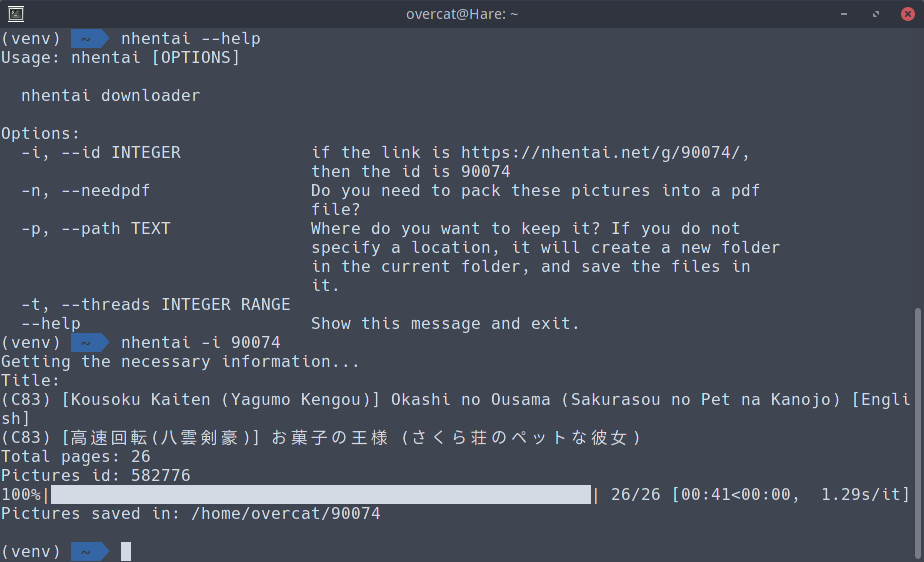

# nhentai
[](https://travis-ci.org/4cat/nhentai)
#### 使用方法
**安装**

环境要求: Python Version >= 3.5
```
git clone https://github.com/4cat/nhentai.git
cd nhentai
python setup.py install
nhentai --help
```
如果你不想安装也可以
```
git clone https://github.com/4cat/nhentai.git
cd nhentai
pip install --user requirements.txt
python run --help
```
**下载**
```
nhentai -i 90074 -t 10 -p /home/overcat/nhentaipic -n
-i id 如果连接为 https://nhentai.net/g/90074/, 那么 90074 就是 id
-t threads threads 为线程数，默认为 5，一般不用改
-p dir_path 保存图片的文件夹，如果不指明，程序会在当前文件夹下新建一个以 id 命名的文件夹保存图片和 PDF
-n 如果加上这个会将图片打包成 PDF 文件
```
**帮助信息**
```
Usage: nhentai [OPTIONS]

  nhentai downloader

Options:
  -i, --id INTEGER             if the link is https://nhentai.net/g/90074/,
                               then the id is 90074
  -n, --needpdf                Do you need to pack these pictures into a pdf
                               file?
  -p, --path TEXT              Where do you want to keep them? If you do not
                               specify a location, it will create a new folder
                               in the current folder, and save the files in
                               it.
  -t, --threads INTEGER RANGE
  --help                       Show this message and exit.

```

